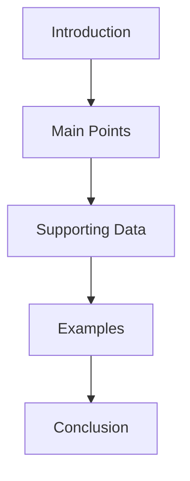

# Presentation Builder
Creating effective presentations made simple

<div class="pt-12">
  <span @click="$slidev.nav.next" class="px-2 py-1 rounded cursor-pointer" hover="bg-white bg-opacity-10">
    Press Space for next page <carbon:arrow-right class="inline"/>
  </span>
</div>

---
layout: default
---

# Table of Contents

1. Introduction
   - Purpose of the presentation
   - Key objectives
   
2. Main Content
   - Key points
   - Supporting evidence
   - Examples

3. Visual Elements
   - Images and diagrams
   - Charts and graphs
   - Code snippets

4. Conclusion
   - Summary
   - Call to action
   - Q&A

---
layout: image-right
image: https://source.unsplash.com/collection/94734566/1920x1080
---

# 1. Introduction

## Purpose
- Clear and concise opening
- Establish context
- Engage audience

## Objectives
- Define goals
- Set expectations
- Preview content

---

# 2. Main Content

<div grid="~ cols-2 gap-4">
<div>

## Key Points
- Focus on core message
- Support with evidence
- Use clear examples

</div>
<div>

## Structure


</div>
</div>

---

# 3. Visual Elements

<div class="grid grid-cols-2 gap-4">
<div>

## Types of Visuals
- Images
- Charts
- Diagrams
- Code blocks

</div>
<div>

## Example Code
```typescript
interface Slide {
  title: string;
  content: string[];
  visuals?: {
    type: 'image' | 'chart';
    url: string;
  }[];
}
```

</div>
</div>

---
layout: center
class: text-center
---

# 4. Conclusion

<div class="grid grid-cols-3 gap-4 mt-4">
<div>
  <h3>Summary</h3>
  <p class="text-sm">Recap key points</p>
</div>
<div>
  <h3>Action Items</h3>
  <p class="text-sm">Next steps</p>
</div>
<div>
  <h3>Questions</h3>
  <p class="text-sm">Open discussion</p>
</div>
</div>

---
layout: end
---

# Thank You!

[Documentation](https://sli.dev) · [GitHub](https://github.com/slidevjs/slidev)